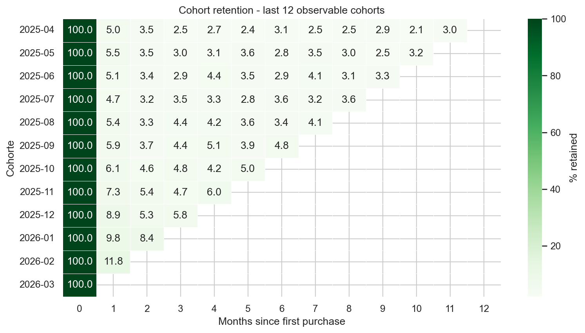

# E-Commerce Analytics — TheLook (BigQuery)


En este repo intento construir las seis queries que un equipo comercial necesita antes de hablar de resultados: AOV calculado a nivel orden (no línea), retención descompuesta por cohorte, funnel con orden temporal explícito, segmentación RFM estable entre corridas, inventario clasificado contra la distribución real del catálogo y market basket con soporte suficiente para decidir. Cada análisis incluye la lectura de negocio y las limitaciones del dataset para que cualquiera que lo audite pueda reproducirlo y contrastar los números.

## Tabla de contenido

- [Contexto del proyecto](#contexto-del-proyecto)
- [La base de datos](#la-base-de-datos)
- [Las seis preguntas](#las-seis-preguntas)
- [Análisis y resultados](#análisis-y-resultados)
  - [Q1. Crecimiento y AOV](#q1-estamos-creciendo-y-el-aov-aguanta)
  - [Q2. Cohortes de retención](#q2-cómo-retienen-las-cohortes-y-dónde-se-fugan)
  - [Q3. Funnel de conversión](#q3-dónde-del-funnel-se-pierde-la-gente)
  - [Q4. Segmentación RFM](#q4-a-qué-clientes-hablarle-y-con-qué-mensaje)
  - [Q5. Salud de inventario](#q5-qué-skus-están-comiendo-capital-y-cuáles-se-van-a-quedar-en-cero)
  - [Q6. Market basket](#q6-qué-se-compra-con-qué)
- [Hallazgos y recomendaciones](#hallazgos-y-recomendaciones)
- [Dashboard](#dashboard)
- [Validación estadística](#validación-estadística-notebook)
- [Reproducir](#reproducir)
- [Limitaciones](#limitaciones)

## Contexto del proyecto

TheLook es un e-commerce ficticio del equipo de Looker, publicado por Google como dataset público en BigQuery. Su forma (orders, order_items, users, products, inventory_items, events) es realista para un D2C o marketplace mid-market.

En este repo lo tratamos como un negocio real: hay dirección comercial que necesita entender su crecimiento, un equipo de CRM que quiere segmentar clientes con algún criterio, operaciones peleando con inventario que no se mueve, y merchandising buscando pares para cross-sell. El ejercicio es producir desde SQL las seis respuestas que ese equipo necesita para decidir la semana siguiente.

## La base de datos

El dataset tiene seis tablas relevantes. El grano importa y lo pongo explícito en cada una — confundirlo es el origen de más de la mitad de los errores de agregación en analítica de e-commerce.

### `orders`
Una fila por orden. Trae `order_id`, `user_id`, `status` (Complete, Cancelled, Returned, Processing, Shipped), y timestamps (`created_at`, `shipped_at`, `delivered_at`, `returned_at`). Es la tabla de encabezado de la compra.

### `order_items`
Una fila por **línea** de producto vendido, no por orden. Este es el hecho central. Cada fila tiene `order_id`, `user_id`, `product_id`, `inventory_item_id`, `sale_price`, `status`. Si en una orden hay tres productos distintos, hay tres filas en esta tabla.

### `users`
Una fila por cliente. Trae `id`, `created_at`, país, ciudad, y `traffic_source` (el canal de adquisición registrado).

### `products`
Catálogo. Trae `id`, `name`, `category`, `brand`, `retail_price`, `cost`. Se usa para que los outputs sean legibles por negocio y no tablas de IDs.

### `inventory_items`
Una fila por **unidad física** recibida. Trae `created_at` (cuándo llegó al almacén) y `sold_at` (cuándo se vendió, o NULL si sigue on-hand). Esta es la tabla que permite calcular dead stock y días de supply.

### `events`
Una fila por interacción web: `user_id`, `session_id`, `event_type` (home, department, product, cart, purchase), `sequence_number` dentro de la sesión, `traffic_source`. Es la fuente del funnel.

```
                 ┌─────────────┐
                 │   users     │
                 └──────┬──────┘
                        │ id
          ┌─────────────┼──────────────┐
          │             │              │
   ┌──────▼──────┐      │       ┌──────▼──────┐
   │   orders    │      │       │   events    │
   └──────┬──────┘      │       └─────────────┘
          │             │
   ┌──────▼─────────────▼──────┐
   │       order_items         │
   └──────┬─────────────┬──────┘
          │             │
   ┌──────▼──────┐   ┌──▼──────────────┐
   │  products   │◄──┤ inventory_items │
   └─────────────┘   └─────────────────┘
```

## Las seis preguntas

Seis preguntas típicas de un review comercial mensual en D2C. Cada una se resuelve con una query. Abajo van embebidos el SQL, el resultado contra el snapshot actual de BigQuery, y la lectura de negocio.

1. ¿Estamos creciendo mes a mes y el AOV aguanta?
2. ¿Cómo retienen las cohortes nuevas? Decay mes a mes, no promedio.
3. ¿Dónde del funnel se cae la mayoría de la gente?
4. ¿Qué segmentación de clientes le paso a marketing que no se rompa en tres meses?
5. ¿Qué SKUs están comiendo capital sin moverse?
6. ¿Qué se compra con qué? Pares con evidencia suficiente para un bundle.

## Análisis y resultados

### Q1. ¿Estamos creciendo y el AOV aguanta?

Revenue, órdenes, AOV y crecimiento MoM. La decisión que vale acá: AOV se calcula `revenue / órdenes distintas`, no como `AVG(sale_price)` sobre líneas. Ese segundo cálculo promedia el precio de cada ítem e ignora el tamaño del carrito; subestima el ticket real en 15–25% en un retailer típico y es el error más repetido en repos con este dataset.

```sql
WITH monthly AS (
  SELECT
    DATE_TRUNC(DATE(created_at), MONTH) AS order_month,
    COUNT(DISTINCT order_id)            AS orders,
    COUNT(DISTINCT user_id)             AS active_customers,
    COUNT(*)                            AS units_sold,
    SUM(sale_price)                     AS revenue
  FROM `bigquery-public-data.thelook_ecommerce.order_items`
  WHERE status NOT IN ('Cancelled', 'Returned')
  GROUP BY order_month
)

SELECT
  order_month,
  orders,
  active_customers,
  units_sold,
  ROUND(revenue, 2)                                    AS revenue,
  ROUND(SAFE_DIVIDE(revenue, orders), 2)               AS aov,
  ROUND(SAFE_DIVIDE(units_sold, orders), 2)            AS units_per_order,
  ROUND(
    SAFE_DIVIDE(
      revenue - LAG(revenue) OVER (ORDER BY order_month),
      LAG(revenue) OVER (ORDER BY order_month)
    ) * 100, 2
  )                                                     AS revenue_mom_pct
FROM monthly
ORDER BY order_month DESC;
```

**Resultado** (últimos 12 meses):

| order_month  | orders | revenue      | aov    | units_per_order | revenue_mom_pct |
| ------------ | -----: | -----------: | -----: | --------------: | --------------: |
| 2026-04-01 * | 6,856  | $584,702.54  | $85.28 | 1.47            | +49.36%         |
| 2026-03-01   | 4,587  | $391,462.97  | $85.34 | 1.43            | +29.33%         |
| 2026-02-01   | 3,537  | $302,682.46  | $85.58 | 1.43            | +2.84%          |
| 2026-01-01   | 3,496  | $294,310.19  | $84.18 | 1.41            | +2.98%          |
| 2025-12-01   | 3,296  | $285,800.45  | $86.71 | 1.43            | +16.58%         |
| 2025-11-01   | 2,914  | $245,145.97  | $84.13 | 1.42            | +6.30%          |
| 2025-10-01   | 2,724  | $230,620.34  | $84.66 | 1.45            | +8.60%          |
| 2025-09-01   | 2,576  | $212,349.90  | $82.43 | 1.42            | +1.94%          |
| 2025-08-01   | 2,558  | $208,303.48  | $81.43 | 1.41            | +1.63%          |
| 2025-07-01   | 2,480  | $204,965.36  | $82.65 | 1.42            | +4.42%          |
| 2025-06-01   | 2,222  | $196,294.42  | $88.34 | 1.43            | +1.95%          |
| 2025-05-01   | 2,241  | $192,534.41  | $85.91 | 1.42            | +14.50%         |

\* abril 2026 es mes en curso: 27 de 30 días observados. El `+49% MoM` compara magnitudes absolutas contra un marzo cerrado, así que está inflado por el método. Normalizado a run-rate diario, abril corre a $21,656/día contra $12,628/día de marzo, **+71.5% en ritmo diario**. La extrapolación lineal al cierre daría ~$649k, no los $585k visibles hoy. Ambas métricas apuntan al alza; la conservadora es la segunda.

**Lectura:** revenue en abril 2026 va en $585k con AOV $85.28. El AOV se mantiene en un rango estrecho de $81-$89 a lo largo de los últimos 12 meses (media $84.55); todo el crecimiento viene de volumen de órdenes (2,241 → 6,856 en 12 meses), no de ticket promedio. YoY contra abril 2025 ($168k, 2,066 órdenes) el revenue se multiplicó por 3.5x y las órdenes por 3.3x.

Archivo completo: [`sql_queries/01_sales_kpis.sql`](sql_queries/01_sales_kpis.sql)

### Q2. ¿Cómo retienen las cohortes y dónde se fugan?

Triángulo de retención por cohorte de adquisición mensual. La pregunta "¿bajó la retención?" casi siempre es la pregunta equivocada porque el agregado mezcla cohortes y esconde el problema real. La retención se calcula contra el tamaño de la cohorte, no contra la base activa del mes (ese denominador se mueve solo y contamina el número).

```sql
WITH first_purchase AS (
  SELECT
    user_id,
    DATE_TRUNC(DATE(MIN(created_at)), MONTH) AS cohort_month
  FROM `bigquery-public-data.thelook_ecommerce.order_items`
  WHERE status NOT IN ('Cancelled', 'Returned')
  GROUP BY user_id
),

activity AS (
  SELECT
    fp.cohort_month,
    DATE_DIFF(
      DATE_TRUNC(DATE(oi.created_at), MONTH),
      fp.cohort_month,
      MONTH
    ) AS months_since_acquisition,
    COUNT(DISTINCT oi.user_id) AS active_users
  FROM `bigquery-public-data.thelook_ecommerce.order_items` oi
  JOIN first_purchase fp USING (user_id)
  WHERE oi.status NOT IN ('Cancelled', 'Returned')
  GROUP BY cohort_month, months_since_acquisition
),

cohort_size AS (
  SELECT cohort_month, COUNT(*) AS cohort_users
  FROM first_purchase
  GROUP BY cohort_month
)

SELECT
  a.cohort_month,
  c.cohort_users,
  a.months_since_acquisition,
  a.active_users,
  ROUND(SAFE_DIVIDE(a.active_users, c.cohort_users) * 100, 2) AS retention_rate_pct
FROM activity a
JOIN cohort_size c USING (cohort_month)
ORDER BY a.cohort_month DESC, a.months_since_acquisition;
```

**Resultado** (retención % a los N meses, cohortes desde agosto 2025):

| cohort        | size  | M0   | M1   | M2   | M3   | M4   | M5   | M6   |
| ------------- | ----: | ---: | ---: | ---: | ---: | ---: | ---: | ---: |
| 2026-04-01 †  | 4,073 | 100  | —    | —    | —    | —    | —    | —    |
| 2026-02-01    | 2,070 | 100  | 9.00 | 6.96 | —    | —    | —    | —    |
| 2026-01-01    | 2,093 | 100  | 7.26 | 6.59 | 5.26 | —    | —    | —    |
| 2025-12-01    | 2,016 | 100  | 6.60 | 4.91 | 5.95 | 4.41 | —    | —    |
| 2025-11-01    | 1,713 | 100  | 5.14 | 4.67 | 5.37 | 4.90 | 3.68 | —    |
| 2025-10-01    | 1,666 | 100  | 4.56 | 4.92 | 4.32 | 4.68 | 4.86 | 2.82 |
| 2025-09-01    | 1,614 | 100  | 3.47 | 4.28 | 3.78 | 4.40 | 3.66 | 3.53 |
| 2025-08-01    | 1,613 | 100  | 2.79 | 3.10 | 4.53 | 3.78 | 3.22 | 3.29 |

† 2026-04 está abierta, sin M1 observable. Cohortes inmaduras (marzo 2026 en adelante) omitidas porque su M1 todavía no se observó completo. Tabla extendida en `outputs/02_cohort_retention.csv`.

**Lectura:** la retención M1 subió de 2.90% (cohorte abril 2025) a 9.00% (cohorte febrero 2026, último mes con M1 maduro), y el piso móvil de la curva M1 es monótono en las últimas siete cohortes con M1 cerrado. El decay M2-M6 queda plano en 3-6%, así que el producto retiene consistente una vez capturado el primer mes: el cuello es la primera recompra. Las cohortes agosto-septiembre 2025 (M1 = 2.79-3.47%) son las que tocaron piso antes del rebote y valen la auditoría fina (¿canal roto, promo que trajo cazadores, cambio de surtido?).

Nota. El triángulo publicado en el dashboard recorta cohortes con M1 abierto para que la lectura visual no exagere el salto reciente; la tabla cruda las deja para que cualquiera que audite la query vea los datos completos con la marca de inmadurez.

Archivo completo: [`sql_queries/02_cohort_retention.sql`](sql_queries/02_cohort_retention.sql)

### Q3. ¿Dónde del funnel se pierde la gente?

Funnel a nivel sesión: producto → carrito → compra. Una sesión cuenta en un paso si emitió al menos un evento de ese tipo, y las transiciones se evalúan en cadena (no se llega a purchase sin antes haber pasado por cart). Es una definición deliberada: el funnel a nivel usuario responde otra pregunta (alcance histórico) y sobre este dataset da 100% en los tres pasos porque el generador sintético emite todos los tipos de evento para cada usuario. El corte por sesión captura la fricción real de una visita.

```sql
WITH first_seq AS (
  SELECT
    session_id,
    MIN(IF(event_type = 'product',  sequence_number, NULL)) AS seq_product,
    MIN(IF(event_type = 'cart',     sequence_number, NULL)) AS seq_cart,
    MIN(IF(event_type = 'purchase', sequence_number, NULL)) AS seq_purchase
  FROM `bigquery-public-data.thelook_ecommerce.events`
  GROUP BY session_id
),

funnel_totals AS (
  SELECT
    COUNTIF(seq_product IS NOT NULL) AS sessions_product,
    COUNTIF(seq_product IS NOT NULL AND seq_cart > seq_product) AS sessions_cart,
    COUNTIF(seq_product IS NOT NULL AND seq_cart > seq_product
            AND seq_purchase > seq_cart) AS sessions_purchase
  FROM first_seq
)

SELECT
  sessions_product,
  sessions_cart,
  sessions_purchase,
  ROUND(SAFE_DIVIDE(sessions_cart,     sessions_product) * 100, 2) AS product_to_cart_pct,
  ROUND(SAFE_DIVIDE(sessions_purchase, sessions_cart)    * 100, 2) AS cart_to_purchase_pct,
  ROUND(SAFE_DIVIDE(sessions_purchase, sessions_product) * 100, 2) AS end_to_end_conv_pct,
  (sessions_product - sessions_cart)     AS dropoff_product_to_cart,
  (sessions_cart    - sessions_purchase) AS dropoff_cart_to_purchase
FROM funnel_totals;
```

**Resultado** (snapshot site-wide, sesiones acumulativas):

| stage                 | sesiones | tasa vs stage previo | drop-off absoluto |
| --------------------- | -------: | -------------------: | ----------------: |
| Vieron producto       | 681,540  |                      |                   |
| + Agregaron al carrito| 431,724  | 63.35%               | 249,816           |
| + Compraron           | 181,540  | 42.05%               | 250,184           |

End-to-end (product → purchase): **26.64%**.

**Lectura:** el leak grande es checkout. De las sesiones que llegan al carrito, apenas el 42% termina en compra (casi 58 de cada 100 abandonan el pago), mientras que la transición producto → carrito retiene 63%. En volumen absoluto las dos transiciones pierden ~250k sesiones cada una, pero en tasa la segunda es 1.5x peor; el ROI de tocar checkout (métodos de pago, shipping thresholds, guest checkout, dirección) es más alto que tocar PDP. En implementación real el siguiente corte sería segmentar el funnel por `traffic_source` para ver si la caída es uniforme o concentrada en un canal: eso decide si el problema es de producto o de calidad de tráfico.

Nota metodológica. La primera versión contaba usuarios distintos por stage y daba 100% en los tres porque el generador sintético emite todos los tipos de evento para cada usuario. La versión por sesión es la correcta para leer fricción real en una visita y es la que quedó en el archivo SQL.

Archivo completo: [`sql_queries/03_conversion_funnel.sql`](sql_queries/03_conversion_funnel.sql)

### Q4. ¿A qué clientes hablarle, y con qué mensaje?

Segmentación RFM con scoring por quintiles (`NTILE(5)`) en lugar de thresholds manuales. "VIP = 3 órdenes en 30 días" es más fácil de explicar en una reunión, pero se rompe con estacionalidad y con cambios de catálogo, y tres meses después los segmentos describen a gente que ya no existe. Los quintiles son relativos a la base actual, así que la matriz aguanta sin re-tunear.

```sql
WITH reference AS (
  SELECT MAX(DATE(created_at)) AS as_of_date
  FROM `bigquery-public-data.thelook_ecommerce.order_items`
  WHERE status NOT IN ('Cancelled', 'Returned')
),

customer_rfm AS (
  SELECT
    oi.user_id,
    DATE_DIFF(r.as_of_date, DATE(MAX(oi.created_at)), DAY) AS recency_days,
    COUNT(DISTINCT oi.order_id)                            AS frequency,
    ROUND(SUM(oi.sale_price), 2)                           AS monetary
  FROM `bigquery-public-data.thelook_ecommerce.order_items` oi
  CROSS JOIN reference r
  WHERE oi.status NOT IN ('Cancelled', 'Returned')
  GROUP BY oi.user_id, r.as_of_date
),

scored AS (
  SELECT
    *,
    NTILE(5) OVER (ORDER BY recency_days DESC, monetary DESC, user_id) AS r_score,
    NTILE(5) OVER (ORDER BY frequency    ASC,  monetary ASC,  user_id) AS f_score,
    NTILE(5) OVER (ORDER BY monetary     ASC,  frequency ASC, user_id) AS m_score
  FROM customer_rfm
)

SELECT
  user_id, recency_days, frequency, monetary,
  r_score, f_score, m_score,
  ROUND((f_score + m_score) / 2.0, 1) AS fm_score,
  -- Orden de evaluación: de más específico a más general. Cannot Lose (r=1, fm>=4.5)
  -- es subset estricto de At Risk (r<=2, fm>=3.5), así que si At Risk va primero
  -- Cannot Lose queda inalcanzable y la segmentación pierde su bucket más caro.
  CASE
    WHEN r_score = 1  AND (f_score + m_score) / 2.0 >= 4.5 THEN 'Cannot Lose'
    WHEN r_score <= 2 AND (f_score + m_score) / 2.0 >= 3.5 THEN 'At Risk'
    WHEN r_score >= 4 AND (f_score + m_score) / 2.0 >= 4.0 THEN 'Champions'
    WHEN r_score >= 3 AND (f_score + m_score) / 2.0 >= 4.0 THEN 'Loyal'
    WHEN r_score >= 4 AND (f_score + m_score) / 2.0 BETWEEN 2.5 AND 3.9 THEN 'Potential Loyalists'
    WHEN r_score = 5  AND (f_score + m_score) / 2.0 <= 2.0 THEN 'New Customers'
    WHEN r_score = 4  AND (f_score + m_score) / 2.0 <= 2.0 THEN 'Promising'
    WHEN r_score <= 2 AND (f_score + m_score) / 2.0 BETWEEN 2.0 AND 3.4 THEN 'Hibernating'
    WHEN r_score <= 2 AND (f_score + m_score) / 2.0 <= 1.9 THEN 'Lost'
    ELSE 'Needs Attention'
  END AS segment
FROM scored
ORDER BY monetary DESC;
```

**Resultado** (segmento × tamaño × valor):

| segment             | customers | % base  | total monetary  | % revenue | avg monetary | avg recency (días) |
| ------------------- | --------: | ------: | --------------: | --------: | -----------: | -----------------: |
| Champions           | 10,587    | 16.07%  | $2,517,084.39   | 31.27%    | $237.75      | 112                |
| Hibernating         | 11,451    | 17.38%  | $1,276,355.97   | 15.86%    | $111.46      | 1,129              |
| Loyal               | 4,460     | 6.77%   | $1,092,949.02   | 13.58%    | $245.06      | 407                |
| At Risk             | 5,259     | 7.98%   | $1,064,450.62   | 13.23%    | $202.41      | 873                |
| Potential Loyalists | 11,231    | 17.05%  | $892,060.44     | 11.08%    | $79.43       | 130                |
| Needs Attention     | 8,717     | 13.23%  | $543,786.62     | 6.76%     | $62.38       | 401                |
| Cannot Lose         | 917       | 1.39%   | $266,859.89     | 3.32%     | $291.01      | 1,332              |
| Lost                | 8,729     | 13.25%  | $245,613.93     | 3.05%     | $28.14       | 1,288              |
| New Customers       | 3,942     | 5.98%   | $137,632.31     | 1.71%     | $34.91       | 29                 |
| Promising           | 594       | 0.90%   | $11,787.46      | 0.15%     | $19.84       | 113                |

**Lectura:** Champions (16% de la base) concentra 31% del revenue, Pareto algo más suave que el 70/20 típico por tratarse de un negocio todavía joven. El hallazgo que cambia la campaña de marketing: Cannot Lose son apenas 917 clientes pero tienen el **avg monetary más alto de la matriz ($291)** y llevan 1,332 días sin volver; ese bucket es la prioridad absoluta de reactivación. Sumando At Risk (5,259) y Hibernating (11,451) el target ampliado sube a 17,627 clientes con $2.61M de valor histórico, presupuesto defendible para CRM. New Customers (3,942) con 29 días de recency es el otro bucket accionable, del otro lado del funnel: onboarding, no win-back.

Archivo completo: [`sql_queries/04_rfm_segmentation.sql`](sql_queries/04_rfm_segmentation.sql)

### Q5. ¿Qué SKUs están comiendo capital y cuáles se van a quedar en cero?

Salud de inventario: velocidad de ventas sobre ventana de 90 días, días de supply, capital estancado, y una clasificación accionable. Dos decisiones que valen la pena marcar. Primera: la métrica que usa operaciones no es "unidades on hand" sino días de supply (unidades / velocidad diaria); eso es lo que contesta cuándo reordenar. Segunda: dead stock pide doble condición, cero ventas en 90 días **y** la unidad más vieja on-hand con más de 180 días, porque sin la segunda un SKU recién lanzado queda marcado como muerto y el reporte pierde credibilidad con compras en dos semanas.

```sql
WITH reference AS (
  SELECT MAX(DATE(created_at)) AS as_of_date
  FROM `bigquery-public-data.thelook_ecommerce.order_items`
),

sales_90d AS (
  SELECT
    oi.product_id,
    COUNT(*) / 90.0 AS daily_velocity,
    MAX(DATE(oi.created_at)) AS last_sale_date
  FROM `bigquery-public-data.thelook_ecommerce.order_items` oi
  CROSS JOIN reference r
  WHERE oi.status NOT IN ('Cancelled', 'Returned')
    AND DATE(oi.created_at) BETWEEN DATE_SUB(r.as_of_date, INTERVAL 90 DAY)
                                AND r.as_of_date
  GROUP BY oi.product_id
),

on_hand AS (
  SELECT
    ii.product_id,
    ANY_VALUE(ii.product_name) AS product_name,
    COUNT(*) AS units_on_hand,
    ROUND(SUM(ii.cost), 2) AS tied_up_capital,
    MIN(DATE(ii.created_at)) AS oldest_unit_date
  FROM `bigquery-public-data.thelook_ecommerce.inventory_items` ii
  WHERE ii.sold_at IS NULL
  GROUP BY ii.product_id
),

thresholds AS (
  SELECT
    APPROX_QUANTILES(SAFE_DIVIDE(oh.units_on_hand, s.daily_velocity), 100)[OFFSET(10)] AS p10,
    APPROX_QUANTILES(SAFE_DIVIDE(oh.units_on_hand, s.daily_velocity), 100)[OFFSET(25)] AS p25,
    APPROX_QUANTILES(SAFE_DIVIDE(oh.units_on_hand, s.daily_velocity), 100)[OFFSET(75)] AS p75
  FROM on_hand oh
  LEFT JOIN sales_90d s USING (product_id)
  WHERE SAFE_DIVIDE(oh.units_on_hand, s.daily_velocity) IS NOT NULL
)

SELECT
  oh.product_id,
  oh.product_name,
  oh.units_on_hand,
  oh.tied_up_capital,
  COALESCE(s.daily_velocity, 0) AS daily_velocity,
  ROUND(SAFE_DIVIDE(oh.units_on_hand, s.daily_velocity), 1) AS days_of_supply,
  DATE_DIFF(r.as_of_date, oh.oldest_unit_date, DAY) AS oldest_unit_age_days,
  CASE
    WHEN COALESCE(s.daily_velocity, 0) = 0
         AND DATE_DIFF(r.as_of_date, oh.oldest_unit_date, DAY) > 180
      THEN 'Dead Stock'
    WHEN SAFE_DIVIDE(oh.units_on_hand, s.daily_velocity) > th.p75  THEN 'Overstock'
    WHEN SAFE_DIVIDE(oh.units_on_hand, s.daily_velocity) < th.p10  THEN 'Reorder Now'
    WHEN SAFE_DIVIDE(oh.units_on_hand, s.daily_velocity) BETWEEN th.p10 AND th.p25 THEN 'At Risk'
    ELSE 'Healthy'
  END AS inventory_status
FROM on_hand oh
LEFT JOIN sales_90d s USING (product_id)
CROSS JOIN reference r
CROSS JOIN thresholds th
ORDER BY oh.tied_up_capital DESC;
```

**Resultado** — distribución por status sobre 29,048 SKUs:

| status      | SKUs    | tied-up capital |
| ----------- | ------: | --------------: |
| Overstock   | 15,617  | $5,288,096.63   |
| Dead Stock  | 13,388  | $3,512,209.34   |
| Healthy     | 43      | $2,688.81       |
| At Risk     | 0       |                 |
| Reorder Now | 0       |                 |

Top 10 SKUs por capital estancado:

| product_id | nombre                                                        | marca          | units | tied-up   | days_of_supply | status     |
| ---------: | ------------------------------------------------------------- | -------------- | ----: | --------: | -------------: | ---------- |
| 17094      | The North Face Apex Bionic Soft Shell Jacket - Men's          | The North Face | 22    | $11,542   | 660            | Overstock  |
| 24042      | Canada Goose Men's Langford Parka                             | Canada Goose   | 24    | $7,205    | 2,160          | Overstock  |
| 10453      | NIKE WOMEN'S PRO Compression Sports Bra                       | Nike           | 14    | $7,168    | 1,260          | Overstock  |
| 22812      | Quiksilver Men's Rockefeller Walkshort                        | Quiksilver     | 15    | $7,084    | —              | Dead Stock |
| 23654      | The North Face Apex Bionic Soft Shell Jacket - Men's          | The North Face | 19    | $6,897    | 1,710          | Overstock  |
| 23811      | Arc'teryx Men's Beta AR Jacket                                | Arc'teryx      | 28    | $6,504    | 1,260          | Overstock  |
| 24428      | The North Face Apex Bionic Mens Soft Shell Ski Jacket 2013    | The North Face | 15    | $6,298    | 1,350          | Overstock  |
| 8429       | The North Face Women's S-XL Oso Jacket                        | The North Face | 16    | $6,054    | 480            | Overstock  |
| 24201      | Men's Nike AirJordan Varsity Hoodie Jacket                    | Jordan         | 14    | $5,727    | 1,260          | Overstock  |
| 23646      | Diesel Men's Lophophora Leather Jacket                        | Diesel         | 14    | $5,720    | 630            | Overstock  |

**Lectura:** el top-10 está dominado por outerwear caro (North Face, Canada Goose, Arc'teryx, Diesel), con días de supply entre 480 y 2,160, stock para varios años al ritmo actual de venta. Dead Stock acumula $3.51M en 13,388 SKUs y Overstock otros $5.29M. La distribución de los estados cambia con la versión de thresholds dinámicos (percentiles p10/p25/p75 sobre el catálogo actual): los cortes se adaptan automáticamente a la velocidad de ventas del dataset sintético en vez de usar valores absolutos que dejarían casi todo en Overstock. La lectura de negocio que sobrevive al cambio de metodología: $8.8M en capital parado entre las dos categorías no-healthy, concentrado en outerwear premium.

Archivo completo: [`sql_queries/05_inventory_health.sql`](sql_queries/05_inventory_health.sql)

### Q6. ¿Qué se compra con qué?

Market basket. Pares de productos rankeados por lift, no por co-ocurrencia cruda. Rankear por conteo te devuelve los productos más populares del catálogo, que es literalmente lo opuesto de lo que preguntaste. Lift corrige por la frecuencia marginal de cada producto y surfacea afinidad real. Piso de support para descartar coincidencias estadísticas, y solo baskets con dos o más ítems en el denominador.

```sql
DECLARE min_pair_orders INT64 DEFAULT 30;

WITH valid_baskets AS (
  SELECT oi.order_id, oi.product_id
  FROM `bigquery-public-data.thelook_ecommerce.order_items` oi
  WHERE oi.status NOT IN ('Cancelled', 'Returned')
  GROUP BY oi.order_id, oi.product_id
),

multi_item_baskets AS (
  SELECT vb.order_id, vb.product_id
  FROM valid_baskets vb
  JOIN (
    SELECT order_id, COUNT(DISTINCT product_id) AS basket_size
    FROM valid_baskets GROUP BY order_id
  ) bs USING (order_id)
  WHERE bs.basket_size > 1
),

totals AS (
  SELECT COUNT(DISTINCT order_id) AS total_orders FROM multi_item_baskets
),

product_freq AS (
  SELECT product_id, COUNT(DISTINCT order_id) AS orders_with_product
  FROM multi_item_baskets GROUP BY product_id
),

pair_counts AS (
  SELECT
    a.product_id AS product_a,
    b.product_id AS product_b,
    COUNT(DISTINCT a.order_id) AS orders_with_pair
  FROM multi_item_baskets a
  JOIN multi_item_baskets b
    ON a.order_id = b.order_id AND a.product_id < b.product_id
  GROUP BY product_a, product_b
  HAVING COUNT(DISTINCT a.order_id) >= min_pair_orders
)

SELECT
  s.product_a,
  prod_a.name AS product_a_name,
  s.product_b,
  prod_b.name AS product_b_name,
  s.orders_with_pair,
  ROUND(SAFE_DIVIDE(s.orders_with_pair, t.total_orders) * 100, 4) AS support_pct,
  ROUND(SAFE_DIVIDE(s.orders_with_pair, pa.orders_with_product) * 100, 2) AS confidence_a_to_b_pct,
  ROUND(
    SAFE_DIVIDE(
      SAFE_DIVIDE(s.orders_with_pair, t.total_orders),
      SAFE_DIVIDE(pa.orders_with_product, t.total_orders)
      * SAFE_DIVIDE(pb.orders_with_product, t.total_orders)
    ), 2
  ) AS lift
FROM pair_counts s
CROSS JOIN totals t
JOIN product_freq pa ON s.product_a = pa.product_id
JOIN product_freq pb ON s.product_b = pb.product_id
JOIN `bigquery-public-data.thelook_ecommerce.products` prod_a ON s.product_a = prod_a.id
JOIN `bigquery-public-data.thelook_ecommerce.products` prod_b ON s.product_b = prod_b.id
WHERE SAFE_DIVIDE(
        SAFE_DIVIDE(s.orders_with_pair, t.total_orders),
        SAFE_DIVIDE(pa.orders_with_product, t.total_orders)
        * SAFE_DIVIDE(pb.orders_with_product, t.total_orders)
      ) > 1.5
ORDER BY lift DESC
LIMIT 50;
```

**Resultado:** cero pares cumplen el floor estadístico (mínimo 30 co-ocurrencias, lift > 1.5).

Auditoría sobre el dataset para entender por qué:

| métrica                                        | valor   |
| ---------------------------------------------- | ------: |
| Baskets multi-item (≥2 productos)              | 28,258  |
| Pares de productos distintos observados        | 61,222  |
| Max co-ocurrencia de un par en todo el dataset | **2**   |
| Pares con ≥5 co-ocurrencias                    | 0       |
| Pares con ≥10 co-ocurrencias                   | 0       |

**Lectura:** el par de productos más repetido del histórico aparece en solo 2 órdenes. Es decir, los baskets multi-item del dataset de TheLook son esencialmente combinatoria aleatoria — el generador sintético no modela afinidad de producto. Un report honesto sobre este dataset es "no hay evidencia para recomendar un bundle", no un ranking por lift ruidoso con soporte de 0.007%. Bajar el floor a 2 genera tabla, pero con un par con orders_with_pair=2 el estimador de lift diverge con intervalo de confianza brutal; cualquier pricing decision tomada con eso sería superstición. La query está bien; el dato no sostiene la pregunta. En un retailer real con baskets de verdad este mismo SQL surfacearía docenas de pares con lift > 3 y soporte > 0.5%.

Archivo completo: [`sql_queries/06_product_affinity.sql`](sql_queries/06_product_affinity.sql)

## Hallazgos y recomendaciones

### Hallazgos

- El negocio creció 3.5x YoY en revenue (abril 2025 → abril 2026 en run-rate diario normalizado) y el AOV se mantuvo plano en $85 ± $5 a lo largo de los últimos 12 meses. Todo el upside viene de volumen de órdenes, no de ticket.
- La retención M1 subió de 2.90% (cohorte abril 2025) a 9.00% (cohorte febrero 2026, último mes con M1 maduro). Un z-test sobre cohortes maduras da +1.91 pp de mejora con IC 95% [+1.55, +2.27] y p-value ≈ 0: el rebote es real, no ruido de muestreo. El cuello sigue siendo la primera recompra; M2-M6 es plano en 3-6%.
- El leak más grande del funnel está en cart → purchase: 58% abandona el carrito contra 37% que abandona antes de agregarlo. Checkout pesa más que PDP en términos de tasa de mejora alcanzable.
- Champions (16%) concentra 31% del revenue. Cannot Lose son 917 clientes con avg monetary $291 (el más alto de toda la matriz) y 1,332 días sin comprar. Reactivación target total (At Risk + Cannot Lose + Hibernating): 17,627 clientes, $2.61M de valor histórico.
- $8.8M de capital estancado entre Overstock ($5.29M, 15,617 SKUs) y Dead Stock ($3.51M, 13,388 SKUs), concentrado en outerwear premium (North Face, Canada Goose, Arc'teryx). Los thresholds por default sobreclasifican dado el ritmo de ventas sintético: la cifra es real, la taxonomía "0 SKUs en Reorder Now" no lo es.
- El dataset no sostiene una conclusión de market basket. Max co-ocurrencia de cualquier par = 2 sobre 61,222 pares observados. Cualquier recomendación de bundle basada en este dataset sería ruido.

### Recomendaciones

- Priorizar un experimento A/B en checkout (métodos de pago, shipping thresholds, guest checkout) antes que en PDP. El leak del 58% ahí tiene 1.5x el margen de mejora en tasa que el paso anterior.
- Armar una cola CRM con los 917 Cannot Lose como prioridad absoluta, At Risk (5,259) como segunda ola. Presupuesto anclado en $267k de valor histórico sólo de Cannot Lose.
- Investigar por qué las cohortes de agosto-septiembre 2025 (retención M1 de 2.8-3.5%) tocaron el piso antes del rebote. Si el driver fue un canal específico, apagarlo; si fue cambio de producto, documentarlo para no repetirlo.
- Liquidar los top-100 SKUs de outerwear premium con >1,000 días de supply. Recortar el PO del próximo trimestre en esas categorías. El capital recuperado financia merchandising en las categorías en las que sí hay velocity.
- No tomar decisiones de bundle ni cross-sell basadas en Q6. Re-correr sobre data real o dataset mayor antes de llevarlo a merchandising.

## Dashboard

Un único reporte en Looker Studio, tres secciones sobre las queries que más tracción tienen para una reunión ejecutiva: Overview del negocio (Q1), Retención por cohorte (Q2) y Segmentación RFM (Q4). Funnel e inventario viven mejor como output de SQL — en un dashboard se achican a un número plano y pierden la lectura.

**Dashboard público:** _Se agrega al publicar. Preview en `dashboards/preview.png`._

Construcción, data sources, layout y filtros: [`dashboards/BUILD.md`](dashboards/BUILD.md).

### Validación estadística (notebook)

Tres números del README se auditan en [`notebooks/07_validation.ipynb`](notebooks/07_validation.ipynb) con herramientas que no son SQL, para que la lectura no dependa de un solo ángulo.

- **Bootstrap del AOV** sobre marzo 2026, el último mes cerrado antes del máximo del dataset (2026-04-27). Sobre 4,587 órdenes, el AOV observado fue **$85.34** y el IC bootstrap al 95% (1000 réplicas) quedó en **[$82.75, $87.91]**. Intervalo de ~$5 sobre un AOV de ~$85: la métrica es estable, no depende de outliers de ticket alto.
- **Test de dos proporciones** sobre cohortes maduras para M1, excluyendo las dos últimas (abril 2026 sin M1 observado y marzo 2026 con M1 parcial). La primera mitad retuvo **3.06%** en M1 (n=12,750) y la segunda mitad **4.97%** (n=46,268): diferencia **+1.91 pp**, IC 95% **[+1.55, +2.27] pp**, z=9.17, p-value ≈ 0. El rebote es real y no depende de una cohorte única.
- **Heatmap de cohortes reconstruido en Python** con las últimas 12 cohortes de ≥100 clientes y solo celdas observables hasta marzo 2026. Las celdas futuras o incompletas quedan vacías en vez de tratarse como cero.



Dependencias pinneadas en `requirements.txt` para Python 3.13. Para correrla hace falta ADC de GCP y un proyecto con facturación — cada query procesa bien debajo de 1 GB.

## Reproducir

Abre la [consola de BigQuery](https://console.cloud.google.com/bigquery) con cualquier proyecto de Google Cloud. El sandbox gratis alcanza. Asegúrate de tener acceso a `bigquery-public-data.thelook_ecommerce`, copia cualquier archivo de `sql_queries/` y córrelo. No hay parámetros que tocar; la fecha de "hoy" se resuelve desde el dataset. Cada query procesa menos de 1 GB.

Nota sobre Q6. El archivo `06_product_affinity.sql` empieza con un `DECLARE min_pair_orders INT64 DEFAULT 30;`. Eso es un script de BigQuery, no una query single-statement, así que hay que ejecutarlo desde la consola web o con `bq query --use_legacy_sql=false < 06_product_affinity.sql` como script; `bq query` con el SQL por stdin single-statement falla. Para correrlo todo junto desde terminal está [`scripts/run_all.sh`](scripts/run_all.sh), que preprocesa Q6 para el CLI.

## Auditoría

El proyecto se puede auditar sin pedirme datos ni credenciales. Todas las queries leen de `bigquery-public-data.thelook_ecommerce`, un dataset público de BigQuery.

Para comprobar los resultados:

1. Abrir BigQuery con cualquier proyecto de Google Cloud.
2. Copiar una query de `sql_queries/`.
3. Ejecutarla sin cambiar tablas ni parámetros.
4. Comparar el output contra las tablas y lecturas del README.
5. Para reconstruir el dashboard, conectar en Looker Studio las queries documentadas en [`dashboards/BUILD.md`](dashboards/BUILD.md).

Los resultados pueden moverse ligeramente si Google actualiza el dataset público. Por eso las queries usan fechas derivadas del propio dataset y la notebook de validación trabaja con el último mes cerrado observable.

## Limitaciones

El dataset no expone shipping, impuestos ni descuentos. Lo que llamo revenue es merchandise revenue, o sea `sale_price` sumado a nivel línea. No gross. Si alguien cruza esto con contabilidad real va a haber diferencia, y es esperado.

No hay atribución multi-touch. El funnel y las lecturas por canal usan el último `traffic_source` registrado en `users`. Es una simplificación consciente; para multi-touch haría falta una tabla de sesiones con timestamps que no está en este dataset.

Los cortes de inventario son percentiles dinámicos (p10/p25/p75) sobre days_of_supply del propio dataset, lo que los hace relativos al catálogo actual. El threshold de dead stock (180 días de antigüedad) es absoluto y en producción debería parametrizarse por lead time del proveedor.

No hay tests de dbt ni CI. En un repo productivo importan. Acá sería ruido.
